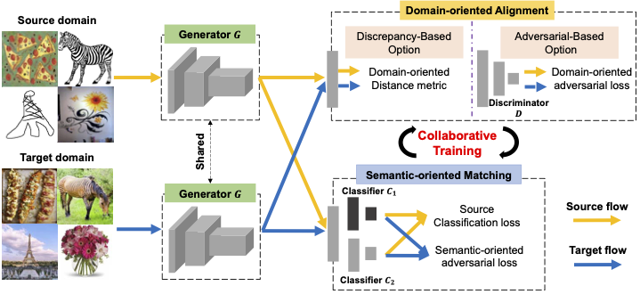

# A Collaborative Alignment Framework for Unsupervised Domain Adaptation (TKDE 2022)

by [Binhui Xie](https://binhuixie.github.io), [Shuang Li](https://shuangli.xyz), [Fangrui Lv](https://scholar.google.com/citations?user=tGxDe8sAAAAJ&hl=en), [Chi Harold Liu](https://cs.bit.edu.cn/szdw/jsml/js/lc/index.htm), [Guoren Wang](https://cs.bit.edu.cn/szdw/jsml/js/wgr/index.htm), and [Dapeng Wu](http://www.wu.ece.ufl.edu)

This repo contains the official **PyTorch** code and models for the CAF.

**Update on 2022/06/24: Paper is available under the "Early Access" area on [IEEE Xplore](https://ieeexplore.ieee.org/document/9803869).**

## One sentence
In this work, we propose a unified framework, called Collaborative Alignment Framework (CAF), which simultaneously reduces the global domain discrepancy and preserves the local semantic consistency for cross-domain knowledge transfer in a collaborative manner.




If you find this project useful in your research, please consider citing:

```bib
@ARTICLE{xie2022caf,
  author={Binhui Xie, Shuang Li, Fangrui Lv, Chi Harold Liu, Guoren Wang, and Dapeng Wu},
  journal={IEEE Transactions on Knowledge and Data Engineering}, 
  title={A Collaborative Alignment Framework of Transferable Knowledge Extraction for Unsupervised Domain Adaptation},
  year={2022},
  volume={},
  number={},
  pages={1-1},
  doi={10.1109/TKDE.2021.3118111}
}
```


##  Setup Environment

For this project, we used python 3.7.5. We recommend setting up a new virtual environment:

**Step-by-step installation**

```bash
conda create --name CAF -y python=3.7
conda activate CAF

# this installs the right pip and dependencies for the fresh python
conda install -y ipython pip

pip install -r requirements.txt
```

### Setup Datasets
- Download [The DomainNet Dataset (cleaned version)](http://ai.bu.edu/M3SDA/)
- Download [The VisDA-2017 Dataset](https://github.com/VisionLearningGroup/taskcv-2017-public/tree/master/classification)
- Download [The Office-31 Dataset](https://faculty.cc.gatech.edu/~judy/domainadapt/)
- Download [The ImageCLEF Dataset](https://imageclef.org/2014/adaptation)

The data folder should be structured as follows:
```
├── data/
│   ├── domainnet/
|   |   ├── clipart/
|   |   ├── infograph/
|   |   ├── painting/
|   |   ├── quickdraw/
|   |   ├── real/
|   |   ├── sketch/
│   ├── visda2017/clf/
|   |   ├── train/
|   |   ├── validation/
│   ├── office31/	
|   |   ├── amazon/
|   |   ├── dslr/
|   |   ├── webcam/	
│   ├── imageCLEF/     
|   |   ├── c/
|   |   ├── i/
|   |   ├── p/
│   └──	
```

Symlink the required dataset
```
ln -s /path_to_domainnet_dataset/ data/domainnet
ln -s /path_to_visda2017_dataset/clf/ data/visda2017
ln -s /path_to_office31_dataset data/office31
ln -s /path_to_imageCLEF_dataset data/imageCLEF
```

## Running the code
For DomainNet (Table 2)
```
bash scripts/domainnet_res50.sh
bash scripts/domainnet_res101.sh
```

For VisDA2017 (Table 3)
```
bash scripts/visda.sh
```

For Office31 (Table 4)
```
bash scripts/office.sh
```

For ImageCLEF (Table 5)
```
bash scripts/celf.sh
```


## Acknowledgements

This project is based on the following open-source projects. We thank their authors for making the source code publicly available.
- [CDAN](https://github.com/thuml/CDAN)
- [JADA](https://github.com/BIT-DA/JADA)


## Contact

If you have any problem about our code, feel free to contact

- [binhuixie@bit.edu.cn](mailto:binhuixie@bit.edu.cn)

or describe your problem in Issues.
